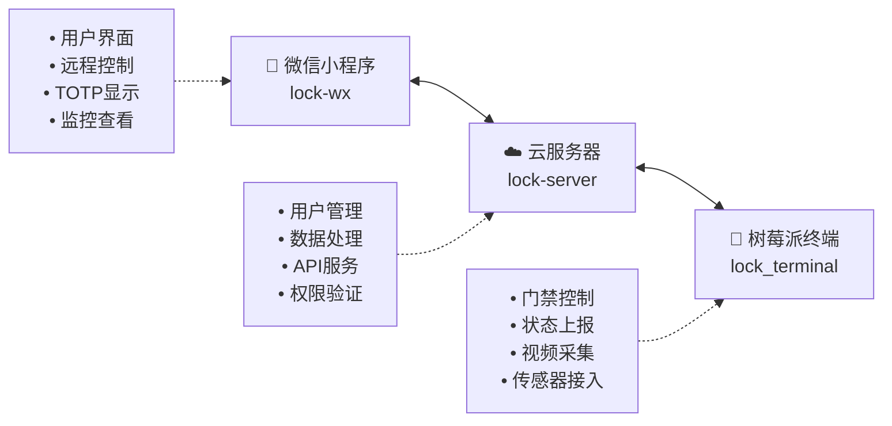

# 🔐 智能门禁系统

[](https://opensource.org/licenses/MIT)
[](https://www.python.org/downloads/)
[](https://djangoproject.com/)

## 📖 项目介绍

本项目是一个基于物联网技术的智能门禁管理系统，采用分布式架构设计，包含云服务器、微信小程序和树莓派终端三个核心组件。该系统提供了远程监控、智能门禁控制、TOTP双因子认证等功能，适用于小区、办公楼、学校等场景的门禁管理。

> 本项目为火炬杯电子创新大赛参赛作品，现已开源分享给社区。

## ✨ 主要功能

- 🔑 **智能门禁控制**：远程开门、定时开门、访客临时授权
- 📱 **微信小程序**：便捷的移动端操作界面
- 🔐 **双因子认证**：基于TOTP的安全认证机制  
- 📹 **实时监控**：门禁状态监控和访问记录查询
- 👥 **用户管理**：多用户权限管理和授权控制
- 🌐 **云端同步**：数据云端存储，多设备同步

## 🏗️ 系统架构



**架构说明：**
- **微信小程序** → 用户交互界面，提供远程控制和监控功能
- **云服务器** → 核心控制中心，处理业务逻辑和数据管理  
- **树莓派终端** → 硬件控制节点，直接操控门禁设备

**数据流向：**
```
用户操作 → 小程序 → 云服务器 → 树莓派 → 门禁设备
设备状态 ← 小程序 ← 云服务器 ← 树莓派 ← 传感器数据
```

## 📂 项目结构

### 📱 微信小程序端 (`lock-wx`)
- **功能**：提供用户友好的移动端操作界面
- **特性**：
  - 远程门禁控制
  - TOTP动态密码生成和显示
  - 实时监控画面查看
  - 用户授权管理
  - 访问记录查询

### ☁️ 云服务器端 (`lock-server`)
- **技术栈**：Django 2.1.7 + Python 3.7+
- **功能**：作为系统的核心控制中心
- **特性**：
  - 用户认证和权限管理
  - RESTful API服务
  - 与小程序和终端的数据交互
  - 操作日志记录
  - 安全策略控制

### 🔧 树莓派终端 (`lock_terminal`)
- **技术栈**：Django + 树莓派GPIO控制
- **功能**：直接控制物理门禁设备
- **特性**：
  - 门禁开关控制
  - 监控视频采集
  - 传感器数据收集
  - 状态实时上报
  - 本地缓存机制

## 🚀 快速开始

### 环境要求

- Python 3.7+
- Node.js 14+ (用于小程序开发工具)
- MySQL 5.7+
- 树莓派 3B+ 或更高版本

### 安装步骤

1. **克隆项目**
   ```bash
   git clone https://github.com/limezc/Lock
   cd Lock
   ```

2. **配置云服务器**
   ```bash
   cd lock_server
   pip install -r requirements.txt
   python manage.py migrate
   python manage.py createsuperuser
   python manage.py runserver
   ```

3. **配置树莓派终端**
   ```bash
   cd lock_terminal
   pip install -r requirements.txt
   # 根据实际硬件配置修改settings.py
   python manage.py runserver 0.0.0.0:8001
   ```

4. **配置微信小程序**
   - 使用微信开发者工具打开 `lock_wx` 目录
   - 修改 `app.js` 中的服务器地址配置
   - 上传小程序代码到微信平台

### 配置说明

详细的配置说明请参考各子项目的文档：
- [服务器端配置](./lock_server/README.md)
- [终端配置](./lock_terminal/README.md)  
- [小程序配置](./lock_wx/README.md)

## 📋 技术栈

| 组件 | 技术栈 |
|------|--------|
| 后端服务 | Django, Python, MySQL |
| 前端小程序 | 微信小程序框架 |
| 硬件控制 | 树莓派, GPIO, OpenCV |
| 安全认证 | TOTP, 微信OAuth |
| 通信协议 | HTTP/HTTPS, WebSocket |

## 🛠️ 开发指南

### API 文档
- 服务器API文档：`http://your-server/api/docs`
- 主要接口包括用户认证、门禁控制、监控数据等

### 硬件接线
- GPIO引脚定义和硬件连接图请参考 [硬件配置文档](./docs/hardware.md)

### 部署建议
- 推荐使用 Docker 进行容器化部署
- 支持 Nginx + Gunicorn 的生产环境部署
- 建议使用 HTTPS 确保通信安全

## 🤝 贡献指南

欢迎提交 Issue 和 Pull Request！

1. Fork 本项目
2. 创建特性分支：`git checkout -b feature/your-feature`
3. 提交更改：`git commit -m 'Add some feature'`
4. 推送分支：`git push origin feature/your-feature`
5. 提交 Pull Request

## 📄 许可证

本项目采用 [MIT 许可证](LICENSE) 开源。

## 🏆 致谢

本项目诞生于火炬杯电子创新大赛，感谢所有参与开发的团队成员和指导老师。

## 📞 联系方式

如有问题或建议，请通过以下方式联系：

- 提交 [Issue](../../issues)
- 发送邮件至：[your-email@example.com]

---

⭐ 如果这个项目对您有帮助，请给个 Star 支持一下！